# Guia de Instalación de **WSL 2** (Subistema) en Windows
WSL 2 (Windows Subsystem for Linux versión 2) es una implementación completa del kernel de Linux desarrollada por Microsoft que se ejecuta directamente sobre Windows, ofreciendo un rendimiento y una compatibilidad mucho mejores con las aplicaciones Linux.

## Características principales de WSL 2: 

1. **Rendimiento mejorado**: WSL 2 ofrece un rendimiento significativamente superior en operaciones de archivo y una compatibilidad completa con llamadas al sistema de Linux, lo que lo hace ideal para tareas exigentes como desarrollo de software, pruebas y automatización. 

2. **Integración con Windows**: Puedes ejecutar herramientas y aplicaciones de línea de comandos de Linux —como bash, grep, ssh, git, etc.— directamente en Windows, sin necesidad de una máquina virtual tradicional. 

3. **Distribuciones disponibles**: Puedes instalar múltiples distribuciones de Linux desde la Microsoft Store, como Ubuntu, Debian, Fedora, Kali Linux, openSUSE y otras. 

4. **Redes**: WSL 2 tiene su propia dirección IP y soporta plenamente redes, servidores web, bases de datos y otras aplicaciones que requieren conectividad de red. 

5. **Gestión de recursos**: Puedes limitar el uso de CPU y memoria de WSL 2 para optimizar el rendimiento de tu sistema. Esto se hace mediante un archivo de configuración llamado .wslconfig en tu carpeta de usuario (%USERPROFILE%\.wslconfig). 

6. **Acceso a archivos**: Puedes acceder fácilmente a los archivos de Windows desde dentro de WSL 2 (en /mnt/c/, /mnt/d/, etc.) y viceversa, lo que facilita el trabajo híbrido entre ambos sistemas. 

## Requisitos Mínimos

- Tener mínimo **Windows 10 versión 1903** (o posterior) con Build 18362 (o posterior).
- Procesador con soporte de *Virtualización*
- Mínimo *4GB* de RAM (8GB Recomendado)
- Espacio de almacenamiento es Disco SSD o NVME minimo *5GB*

# Habilitar Virtualización en Windows
**Verificar Virtualización:** Abre administrador de tareas (Crtl-Shift-Esc)
Navega: *Rendimiento > CPU > Virtualización*
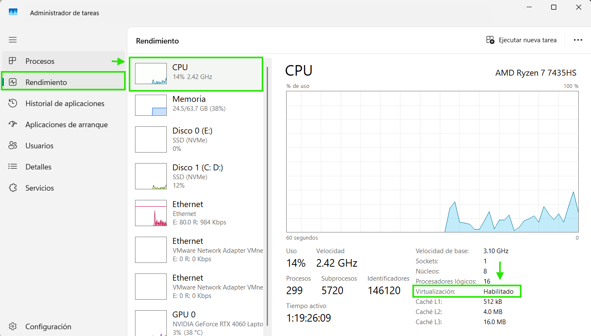

## Habilitar Virtualización
Abrir PowerShell como administrador y habilitar:
```bash
dism.exe /online /enable-feature /featurename:Microsoft-Windows-Subsystem-Linux /all /norestart
```

# Instalar WSL2 en Windows

Abrir PowerShell como administrador y habilitar WSL:

```bash
dism.exe /online /enable-feature /featurename:Microsoft-Windows-Subsystem-Linux /all /norestart
```
Necesario `Reiniciar el equipo`.

## Verificar Instalación y Activar WSL v2
En la terminal ejecutar:
```bash
wsl
```
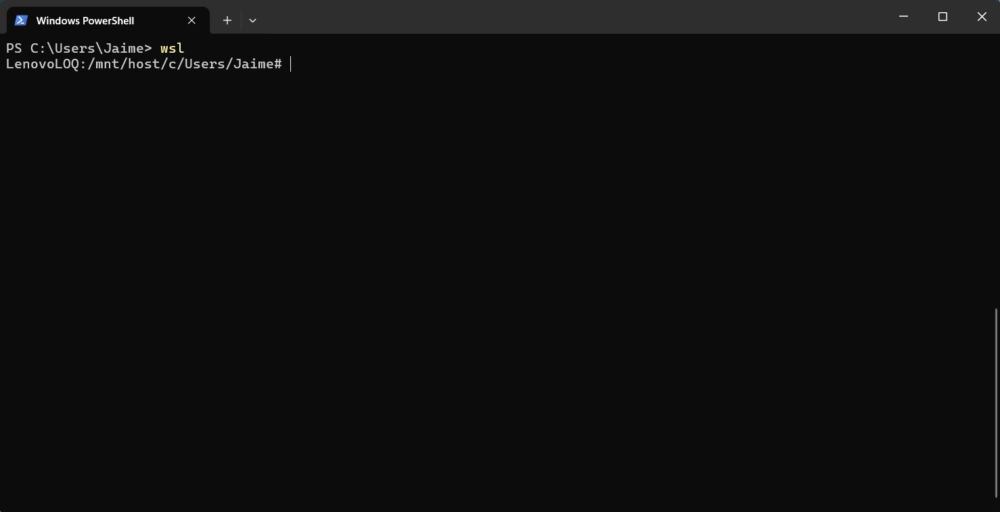

Establecer WSL2 como versión predeterminada:
```bash
wsl --set-default-version 2
```

Actualizar WSL:
```bash
wsl --update
```
Nota: `Si pide actualizar [Descargar WSL2](https://wslstorestorage.blob.core.windows.net/wslblob/wsl_update_x64.msi) y ejecuta el instalador de actualización manualmente`

Apagar todas las instancias WSL
```bash
wsl --shutdown
```

# Comandos básicos con WSL

## Listar las instancias instaladas en Windows
Abre comando en la terminal o PowerShell:

 ```bash
wsl --list --verbose
```
o su versión corta:
```bash
wsl -l -v
```
Resultado
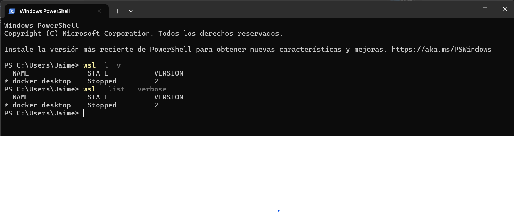
## Listar instancias en ejecucion
Abre comando en la terminal o PowerShell:

```bash
wsl --list --running
```
## Listar las distribuciones disponibles con:

```bash
wsl --list --online
```
Se mostrará una lista similar a:
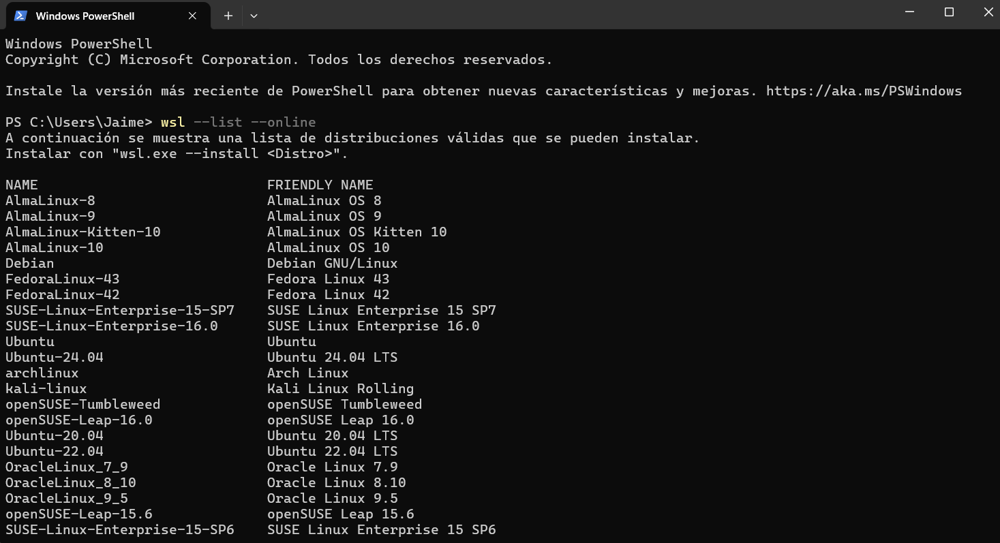

# Instalar Ubuntu-24.04 en WSL 2

## *Método 1*: Instalar desde la terminal con WSL

Abrir PowerShell como administrador e Instalar Ubuntu 24.04 con:

```bash
wsl --install -d Ubuntu-24.04
```
Esperar a que finalice la instalación y luego inicia completar la configuración inicial.
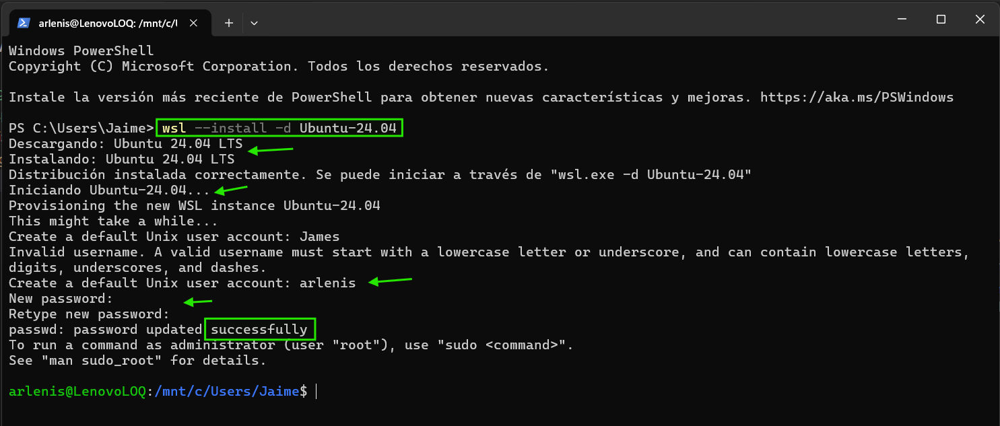
## *Método 2*: Instalar desde Microsoft Store

Abrir Microsoft Store en Windows.

Buscar `Ubuntu` y elegir `Ubuntu 24.04 LTS`.

Hacer clic en `Obtener` o `Instalar`.

Una vez instalada, iniciar la aplicación para terminar la configuración.
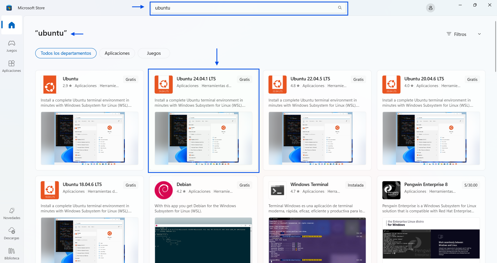

# Iniciar instancia Ubuntu 24.04 en WSL2
 Abrir una ventana de PowerShell o CMD o Terminal y ejecutar el comando:

```bash
wsl -d Ubuntu-24.04
```
Resultado:
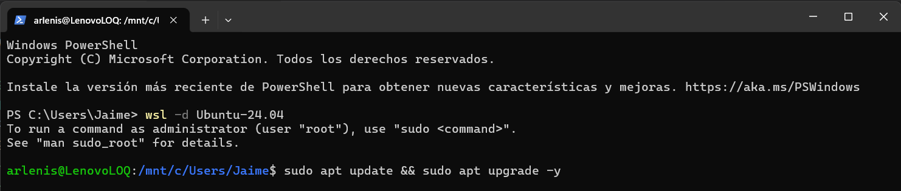
# Apagar Instancia Ubuntu 24.04 en WSL2
 Abrir una ventana de PowerShell o CMD o Terminal y ejecutar el comando:

```bash
wsl --terminate Ubuntu-24.04
```
Resultado:
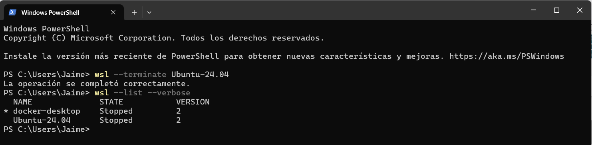

Apagar todas las instancias
```bash
wsl --shutdown
```
Resultado:
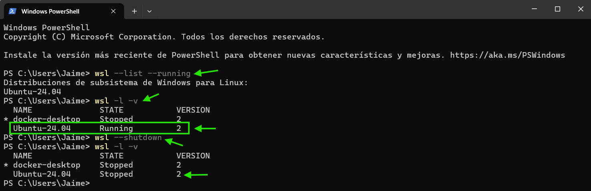
# Eliminar instancia de ubuntu creada con WSL2
 Abrir una ventana de PowerShell o CMD o Terminal y ejecutar el comando:

```bash
wsl --unregister Ubuntu-24.04
```
Resultado:
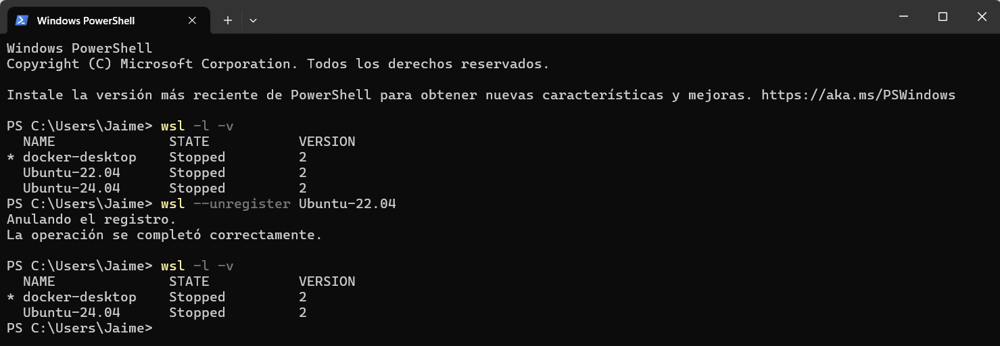

# Accessing Windows Files from Linux

Navegar `\\wsl$\<DistributionName>` in File Explorer

```bash
\\wsl.localhost\Ubuntu-24.04
```
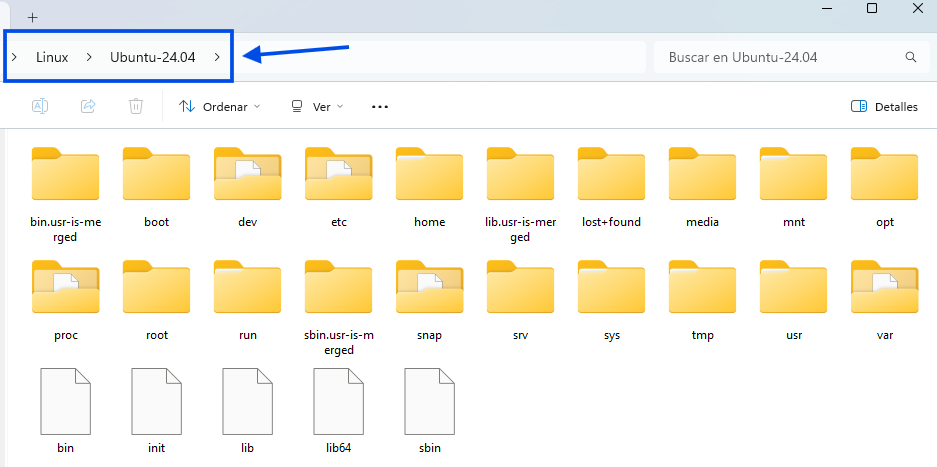

© 2025 Jaime Llanos Bardales.  
Este trabajo está bajo una licencia [Creative Commons Attribution 4.0 Internacional](LICENSE).